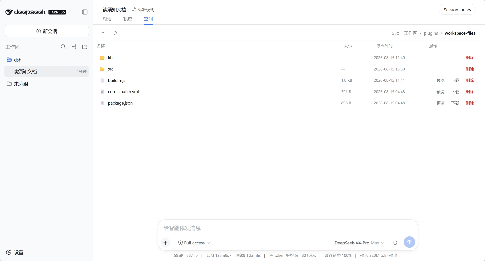
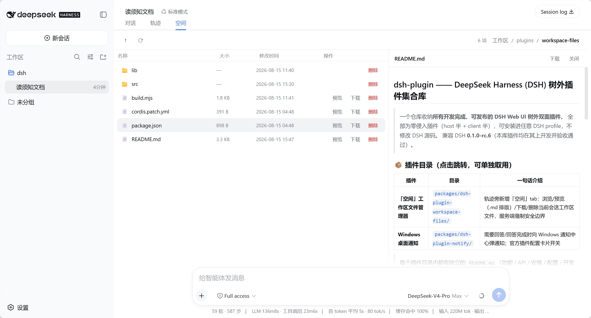
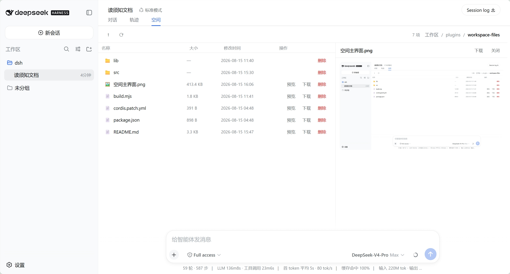
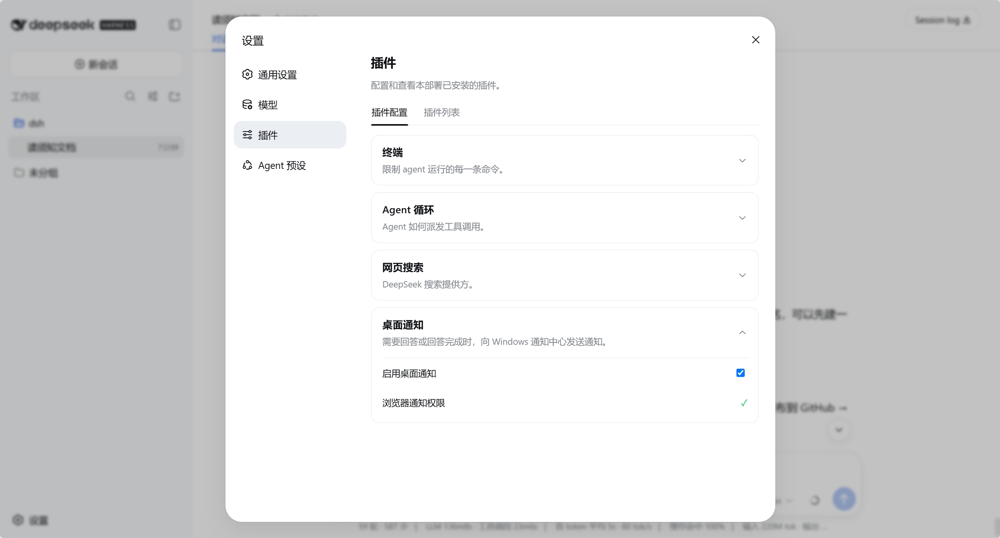
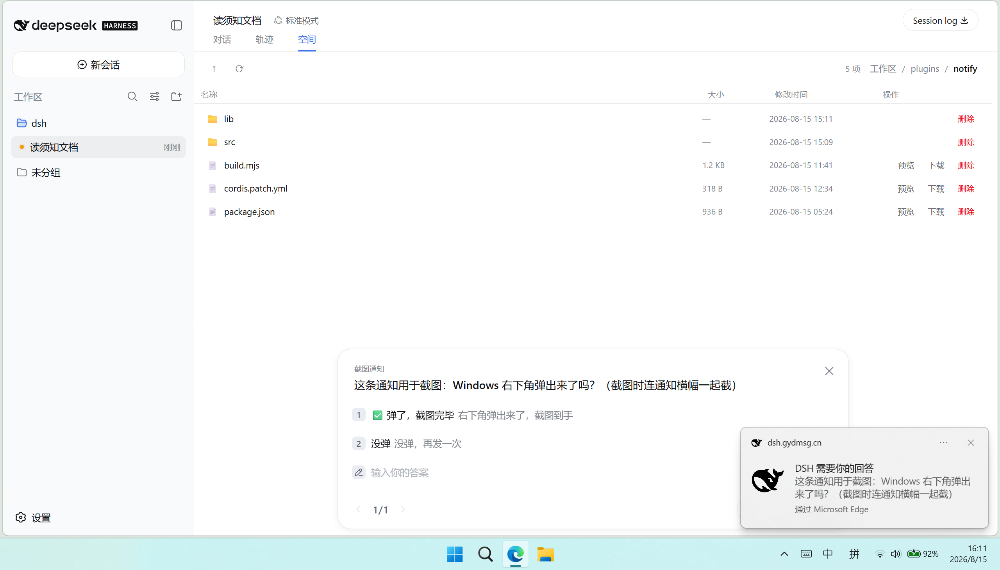

# dsh-plugin — Out-of-Tree Plugin Collection for DeepSeek Harness (DSH)

[English](README.en.md) | [中文](README.md)

> One repository collecting **every finished, publishable, out-of-tree dual-face plugin for the DSH Web UI**.
> All plugins are zero-invasive (host half + client half): installable into any DSH profile without touching DSH source.
> Compatible with DSH **0.1.0-rc.6** (all plugins here were developed and accepted on it).

## 📦 Plugins (jump in — each can be used on its own)

| Plugin | Directory | In one sentence |
|---|---|---|
| **Space — Workspace File Explorer** | [`packages/dsh-plugin-workspace-files/`](./packages/dsh-plugin-workspace-files) | Adds a "Space" tab next to Trajectory: browse / preview (rendered Markdown) / download / delete files of the current session workspace, with a server-enforced security boundary |
| **Windows Desktop Notifications** | [`packages/dsh-plugin-notify/`](./packages/dsh-plugin-notify) | Sends Windows notification-center toasts when DSH needs your answer or finishes answering; official-style plugin config card |

> Every plugin directory has its own `README.md` (features / API / install / config / development / roadmap). To use a single plugin, just take that directory.

## 📸 Screenshots

### Space — Workspace File Explorer

**Space tab overview** (new tab next to Trajectory):



**Markdown preview** (web-rendered, not plain text):



**Image preview**:



### Windows Desktop Notifications

**Plugin config card** (Settings → Plugins → Plugin configuration, same style as official cards):



**Windows toast** (when DSH needs your answer):



## 🚀 Installation (works on any DSH deployment)

> ⚠️ **One-command npm install (`dsh plugin add`) is not published yet** — coming soon. Until then, install manually as below.

Example: installing both plugins.

1. Put the plugin directories into the target profile's `node_modules/@dsh/`
2. Append the package names to `dsh.profile.bundles` in the profile's `package.json` (after `@deepseek-ai/dsh-web-app`):

```jsonc
"dsh": { "profile": { "bundles": [
  "@deepseek-ai/dsh-base",
  "@deepseek-ai/dsh-web-app",
  "@dsh/plugin-workspace-files",
  "@dsh/plugin-notify"
] } }
```

3. Restart `dsh-web`; verify with `dsh --profile web --dump-config` (both plugin rows present, no warnings)
4. Hard-refresh the browser

## 🧱 Plugin Structure & Development Conventions

- **Dual-face plugin**: host half `lib/index.js` (Node built-ins only, zero third-party runtime deps) + client half `lib/client.js` (official `window.__ModuleLoader__.load` format, built from `src/*.tsx`)
- Host extension surface: `ctx.webServer.register` (REST routes), `ctx.sessions` / `ctx.workspaceRegistry` (session → workspace root resolution)
- Client extension surface: `ctx.slots` (tab slot `conversation.view`, config-card slot `settings.plugin.item`), `ctx.locale`, `ctx.connection.api.subscribeEnvelopes`, `ctx.conversationEvents`
- Build: `npm i esbuild && node build.mjs`
- **Gotcha (must follow)**: the build footer must export via the `globalThis.__pluginXxx` anchor — referencing a bare `apply` gets polluted by same-named variables in non-strict third-party code (e.g. marked), causing "Function.prototype.apply was called on [object Object]"
- Security-sensitive plugins (file operations) keep their boundary logic in the host half with `node --test` coverage

## 🧪 Tests

```sh
cd packages/dsh-plugin-workspace-files && node --test test/*.test.mjs   # 9 security-boundary tests
```

## 🗺 Roadmap

- Space v0.2: rename / new folder / multi-select / Ctrl+C/V/X/Delete shortcuts
- Space v0.3: drag-to-move, "…" context menu, drag-in upload from the OS
- Notify v0.2: background job / subagent / goal events, dedup, settings toggles
- Polish: directory tree / sorting / search / zip; notification action buttons / quiet hours

## License

MIT
